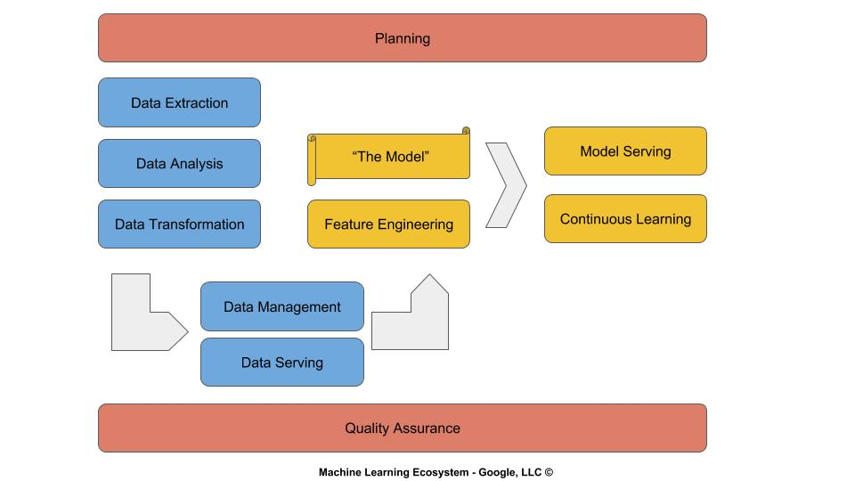

# Gap CV

  

## Intro

**Gap** is a data engineering framework for machine learning. The **GapCV** is a component of **Gap** for computer vision (CV). The component manages data preparation of images, feeding and serving neural network models, and data management of persistent storage.

The module is written in a modern *object oriented programming (OOP)* abstraction with an *imperative programming* style that fits seamlessly into ML frameworks which are moving into imperative programming, such as **Keras** and **PyTorch**. The bottom layers of the module are written in a *bare metal* style for high performance.

**Gap** was inspired by a meeting of data scientists and machine learning enthusiasts in Portland, OR in May 2018. The first version of **Gap** was available during the summer and the local software community was engaged through meetups, chats, Kaggle groups, and a conference at the Oxford Suites. During the Fall, a decision was made to refactor **Gap** into an industrial grade application, spearheaded by Gap's lead, David Molina, and overseen and assisted by Andrew Ferlitsch, Google AI. 

## Why and Why Now

During the Spring of 2018, many of us had observed advancements in redesign of ML frameworks (such as Keras and PyTorch) to migrate into frameworks which would have broader adoption in the software engineering community. But, the focus was primarily on the model building and not on the data engineering. Across the Internet, between blogs, tutorials and online classes, the examples for data engineering was still a wild west. To us, we saw this as a gap, and hence the name Gap

ML practitioners today recognize the substantial component that data engineering is within the machine learning ecosystem, and the need to modernize, streamline and standardize to meet the needs of the software development community at the same pace as framework advancements are being made on the modeling components.

  

## Summary of Features

### Image Types

The following image formats are supported: 

    * JPEG and JPEG2000
    * PNG
    * TIF
    * GIF
    * BMP
    * 8 and 16 bits per pixel
    * Grayscale (single channel), RGB (three channels) and RGBA (four channels)
    
### Image Set (Dataset) Layouts

The following image set layouts are supported (i.e., can be ingested by Gap):  

    * On-Disk (directory, CSV and JSON)
    * In-Memory (list, numpy)
    * Remote (http)
    
For CSV and JSON, the image data can be embedded (in-memory), local (on-disk) or url paths (remote).

### Image Transformations

The following image transformations are supported: 

    * Color -> Gray
    * Resizing
    * Flattening
    * Normalization and Standardization
    * Data Type Conversion: 8 and 16 bpp integer and 16, 32 and 64 bpp float
    
Transformations can be performed when processing an image set (ingestion) or performed dynamically when feed during training.

### Image Augmentation

The following image augmentations are supported.

    * Rotation
    * Horizontal and Vertical Flip
    * Zoom
    * Brightening
    * Sharpening
    
Image augmentation can be performed dynamically in-place during feeding (training) of a neural network.

### Image Feeding

The following image feeding mechanisms are supported:

    * Splitting 
    * Shuffling
    * Iterative
    * Generative
    * Mini-batch
    * Stratification
    * One-Hot Label Encoding

When feeding, shuffling is handled using indirect indexing, maintaining the location of data in the heap. One-hot encoding of labels is performed
dynamically when the feeder is instantiated.

### In-Memory Management

The following are supported for in-memory management:

    * Contiguous Memory (Numpy)
    * Streaming
    * Indirect Indexing (Shuffling w/o moving memory)
    * Data Type Reduction
    * Collection Merging
    * Asynchronous and Concurrent Processing
    
Collections of image data, which are otherwise disjoint, can be merged efficiently and with label one-hot encoding performed dynamically for feeding neural networks from otherwise disparate sources.

### Persistent Storage Management

The following are supported for on-disk management:

    * HDF5 Storage and Indexing
    * Metadata handling
    * Distributed

## Pip Installation: 

The **GapCV** framework is supported on Windows, MacOS, and Linux. It has been packaged for distribution via PyPi on launch.

  1. install [miniconda](https://conda.io/miniconda.html)

  2. install conda virtual environment and required packages
      + Create an environment with: `conda create -n gap python==3.5 jupyter pip`  
      + Activate: `source activate gap`
      + `pip install gapcv`

  3. exiting conda virtual environment:
      + Windows: `deactivate`
      + Linux/macOS: `source deactivate`

## Setup.py Installation:

To install **GapCV** via setup.py:

  1. clone from the Github repo.  
      + `git clone https://github.com/gapml/CV.git`

  2. install the GapML setup file. 
      + access folder `cd CV`
      + `python setup.py install`

## Quick Start

## Reference
